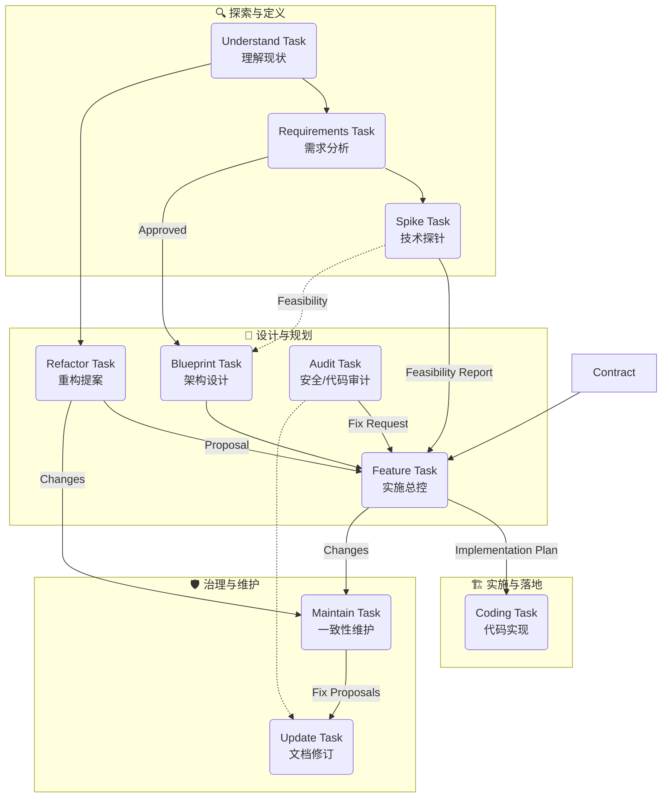

# AI 辅助开发工作流 (AI-Assisted Development Workflow)

> **Philosophy**: 文档即代码 (Docs as Code)。我们通过一系列标准化的任务，将需求分析、架构设计、代码实现和维护工作转化为结构化的文档流。

## 🌐 上下文流转图 (Context Flow)

这个工作流并不是线性的，而是一个闭环系统。以下是核心任务之间的流转关系：



## 📂 任务清单 (Task Catalog)

所有的任务定义位于 `core/tasks/`，对应的输出模版位于 `core/templates/`。

| 任务文件 | 角色 (Role) | 目标 (Goal) | 输出路径 |
| :--- | :--- | :--- | :--- |
| **[understand.md](core/tasks/understand.md)** | 探险家 (Explorer) | 理解现有代码库，生成系统/模块地图。 | `docs/understand/` |
| **[requirements.md](core/tasks/requirements.md)** | 分析师 (Analyst) | 澄清用户需求，生成结构化需求文档 (PRD)。 | `docs/requirements/` |
| **[spike.md](core/tasks/spike.md)** | 起草人 (Drafter) | 技术可行性验证，输出原型和调研报告。 | `docs/spike/` |
| **[blueprint.md](core/tasks/blueprint.md)** | 架构师 (Architect) | 系统级设计，产出架构蓝图并拆解为 Feature Tasks。 | `docs/blueprint/` |
| **[feature.md](core/tasks/feature.md)** | TDD 专家 (TDD Pro) | **[总控]** 将需求/提案/报告转化为实施计划。 | `docs/feature/` |
| **[coding.md](core/tasks/coding.md)** | 工程师 (Engineer) | **[执行]** 严格遵循计划将伪代码转化为代码。 | *源码变更* |
| **[refactor.md](core/tasks/refactor.md)** | 精修师 (Refactorer) | 产出重构提案 (Proposal) 而非实施计划。 | `docs/refactor/` |

### 3. 特殊任务 (Specialized Tasks)

| 任务文件 | 负责角色 | 描述 | 输出位置 |
| :--- | :--- | :--- | :--- |
| **[contract.md](core/tasks/contract.md)** | 接口员 (Specifier) | **[可选]** 定义 HTTP/RPC 接口契约，适用于前后端分离项目。 | `docs/contract/` |
| **[spike.md](core/tasks/spike.md)** | 起草人 (Drafter) | 产出可行性报告 (Feasibility Report)。 | `docs/spike/` |
| **[audit.md](core/tasks/audit.md)** | 找茬员 (Validator) | 产出问题清单，严重问题转交 Feature。 | `docs/audit/` |
| **[update.md](core/tasks/update.md)** | 编辑 (Editor) | **[治理]** 根据指令精准修订单份文档。 | *原位修改* |
| **[maintain.md](core/tasks/maintain.md)** | 图书管理员 (Librarian) | **[治理]** 扫描并修复文档库的一致性问题。 | *控制台/报告* |

## 🚀 使用指南 (Usage Guide)

### 1. 启动任务

将任务文件的内容作为 Prompt 发送给 AI，同时附上相关的上下文（如 `context output`）。

**基本格式**:
> "请执行 [任务名]，[你的具体输入]..."

### 2. 输出管理

所有 AI 生成的文档都会自动保存在 `docs/` 目录下，并按照以下命名规范进行归档：
`yy_mm_dd_{summary}_{task_type}_{version}.md`

例如: `26_01_15_user_login_feature_v1.md`

### 3. 文档治理

- **当需求变更时**: 优先运行 `Update Task` 修改需求文档，然后运行 `Maintain Task` 让 AI 检查对下游（架构、测试）的影响。
- **当完成代码后**: 运行 `Understand Task` 更新系统地图，保持文档与代码同步。

## 📁 目录结构 (Structure)

```text
.workflow/
├── README.md               # 本文件
├── core/                   # 核心定义
│   ├── roles/              # 角色 (Persona) 定义
│   ├── tasks/              # 任务 (Prompt) 定义
│   └── templates/          # 输出模版 (Templates)
└── docs/                   # [自动生成] 归档目录
    ├── audit/
    ├── blueprint/
    ├── contract/
    ├── feature/
    ├── refactor/
    ├── requirements/
    ├── spike/
    └── understand/
```
