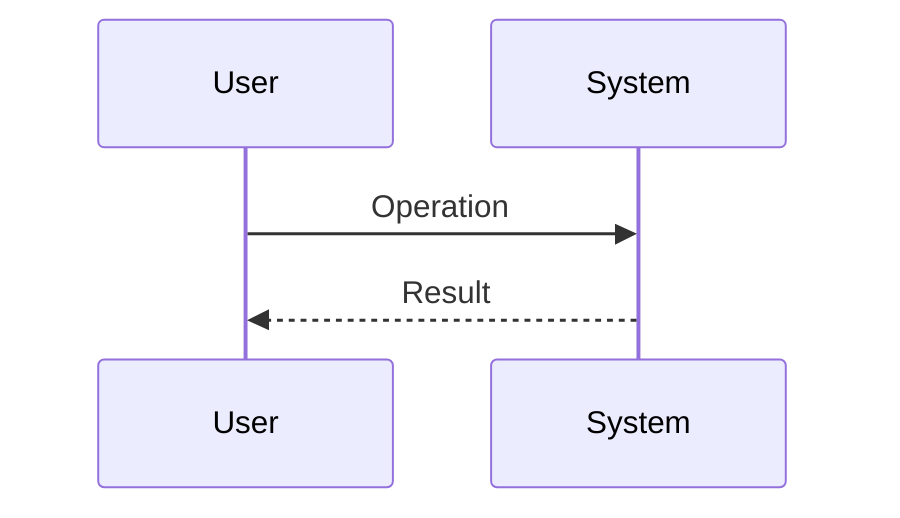
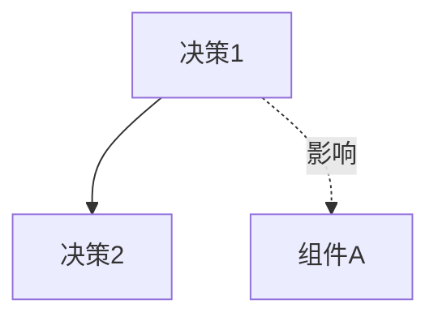

# 技术蓝图 (Technical Blueprint)

## 设计目标 (Design Objective)

{{简要描述架构设计的核心目标和约束}}

## 技术选型 (Technology Stack)

| 类别 | 选择 | 理由 |
| :--- | :--- | :--- |
| 语言/运行时 | {{例如: Python 3.11}} | {{选择理由}} |
| 框架 | {{例如: FastAPI}} | {{选择理由}} |
| 数据库 | {{例如: PostgreSQL}} | {{选择理由}} |
| 缓存 | {{例如: Redis}} | {{选择理由}} |
| 部署 | {{例如: Docker + K8s}} | {{选择理由}} |

## 目录结构 (Project Structure)

```text
{{项目名}}/
├── src/
│   ├── {{模块1}}/
│   │   ├── __init__.py
│   │   ├── {{文件}}.py
│   │   └── ...
│   ├── {{模块2}}/
│   └── ...
├── tests/
├── docs/
├── scripts/
├── {{配置文件}}
└── README.md

```

### 核心业务流程 (Core Workflow)



## 模块划分 (Module Design)

### {{模块名称 1}}

- __职责__: {{该模块负责什么}}
- __依赖__: {{依赖哪些其他模块}}
- __对外接口__: {{暴露哪些 API 或方法}}

### {{模块名称 2}}

- __职责__: {{该模块负责什么}}
- __依赖__: {{依赖哪些其他模块}}
- __对外接口__: {{暴露哪些 API 或方法}}

## 架构图 (Architecture Diagram)

```mermaid
graph TD
    A[{{组件A}}] --> B[{{组件B}}]
    B --> C[{{组件C}}]
    B --> D[{{组件D}}]
```

## 关键设计模式 (Key Design Patterns)

| 模式名称 | 应用场景 | 理由/好处 |
| :--- | :--- | :--- |
| {{例如: Factory Method}} | {{例如: 创建不同类型的 OrderHandler}} | {{例如: 解耦创建逻辑，易于扩展新订单类型}} |
| {{例如: Singleton}} | {{例如: DatabaseConnectionPool}} | {{例如: 全局唯一，节省资源}} |

## 关键设计决策 (Key Design Decisions)

### 决策 1: {{决策标题}}

- __问题__: {{面临的问题}}
- __方案__: {{选择的方案}}
- __备选__: {{考虑过的其他方案}}
- __理由__: {{为什么选择这个方案}}
- __风险__: {{潜在风险}}

### 决策 2: {{决策标题}}

- __方案__: {{选择的方案}}
- __理由__: {{为什么选择这个方案}}
- __风险__: {{潜在风险}}

### 决策关系图 (Decisions Map)



## 实施拆解 (Implementation Breakdown)

__重要：__ 请将架构蓝图拆解为具体的下游任务列表。

- [ ] __Feature Task 1__: {{例如: 基础框架搭建}}
- [ ] __Contract Task 1__: {{例如: API 接口定义}}
- [ ] __Feature Task 2__: {{例如: 核心业务流程实现}}
