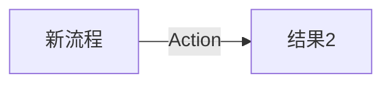

# 实现计划 (Implementation Plan)

## 需求 (Requirements)

### 核心接口定义 (Public Interface Design)

- **Class/Module**: `{{TargetComponent}}`
- **Method Signature**:

  ```python
  def method_name(arg1: Type, arg2: Type) -> ReturnType:
      """Docstring definition"""
  ```

- **Reason**: {{Why this signature?}}

### 依赖影响 (Dependency Impact)

### 验收标准 (Acceptance Criteria)

- [ ] AC1: {{验收标准 1}}
- [ ] AC2: {{验收标准 2}}

### 备选方案 (Alternatives)

- **方案 A**: {{描述}} - [ ] ❌ 驳回 (理由: ...)
- **方案 B**: {{描述}} - [ ] ✅ 采纳 (理由: ...)

## 约束与复用检查 (Constraints & Reuse)

- [ ] **配置检查**: 本次变更是否修改了 `config/` 下的文件？ (是/否 - 若是，请说明理由)
- [ ] **接口检查**: 本次变更是否修改了 Public API？ (是/否 - 若是，需附带 Contract 更新)
- [ ] **复用分析**:
  - 需实现功能: `{{功能A}}`
  - 现有候选: `{{src/utils/xxx.py}}`
  - 决策: [复用 | 新写]

## 影响分析 (Impact Analysis)

### 受影响范围 (Scope)

- **模块**: {{受影响的模块}}
- **API**: {{是否有 Breaking Changes}}
- **数据**: {{是否有 Schema 变更}}

### 风险 (Risks)

- {{风险点 1}}
- {{风险点 2}}

## 逻辑变更 (Logic Changes)

### 流程/状态对比 (Flow/State)




## 详细变更计划 (Detailed Changes)

### 1. 新增/修改文件: `{{文件路径}}`

- **变更类型**: [新增 | 修改 | 删除]
- **变更描述**:
  - {{详细描述逻辑变更}}
  - {{伪代码或关键逻辑}}

### 2. 新增/修改文件: `{{文件路径}}`

- **变更类型**: [新增 | 修改 | 删除]
- **变更描述**:
  - {{详细描述逻辑变更}}

## 实施步骤 (Execution Steps)

1. [ ] 创建文件 `{{文件路径}}`
2. [ ] 在 `{{文件路径}}` 中添加函数 `{{函数名}}`
3. [ ] 运行测试 `{{测试指令}}`

## 验证计划 (Verification Plan)

- **自动化测试**: {{需要编写的测试用例描述}}
- **手动验证**: {{手动验证步骤}}
