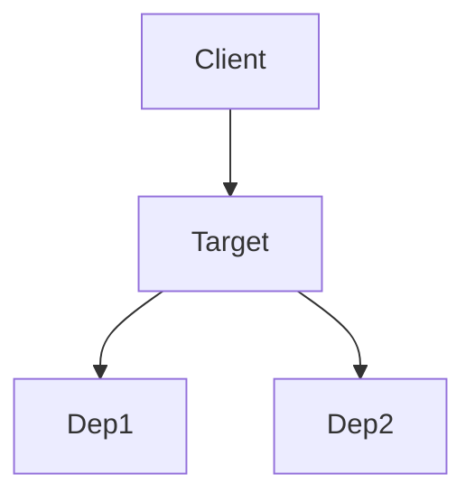
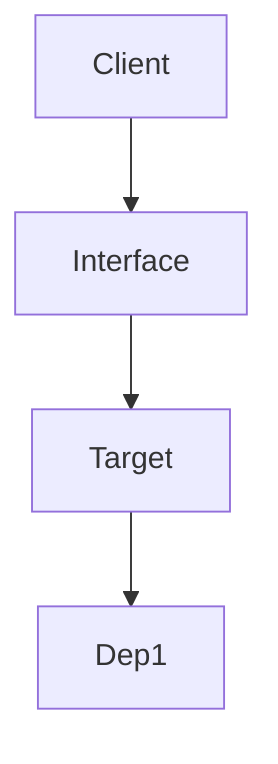

# 重构计划 (Refactor Plan)

## 动机 (Motivation)

### 重构目标

{{在此填写第 1 步中定义的重构目标}}

### 识别出的坏味道 (Code Smells)

- {{坏味道 1}}
- {{坏味道 2}}

## 依赖分析 (Dependency Analysis)

### 依赖半径 (Dependency Radius)

- **上游 (Callers)**: 谁调用了我？
  - `{{调用方组件/文件}}`
- **下游 (Callees)**: 我调用了谁？
  - `{{被调用组件/文件}}`

### 依赖关系图 (Dependency Graph)

**Before**:



**After**:



### 潜在影响 (Potential Impact)

- [ ] ⚠️ 是否修改了公开接口？
- [ ] ⚠️ 是否影响了下游的假设（如非空校验）？

## 变更方案 (Proposed Changes)

### 结构调整 (Structural Changes)

- **新增模块/类**: {{描述}}
- **移除模块/类**: {{描述}}
- **移动逻辑**: 从 `{{A}}` 移动到 `{{B}}`

### 代码示例对比 (Before vs After)

#### 当前 (Current)

```{{语言}}
{{当前代码片段}}
```

#### 建议 (Proposed)

```{{语言}}
{{建议代码片段}}
```

## 实施步骤 (Execution Steps)

1. [ ] {{步骤 1}}
2. [ ] {{步骤 2}}

## 验证策略 (Verification Strategy)

- [ ] 确保测试 `{{测试名}}` 通过
- [ ] 增加新测试 `{{新测试描述}}`
