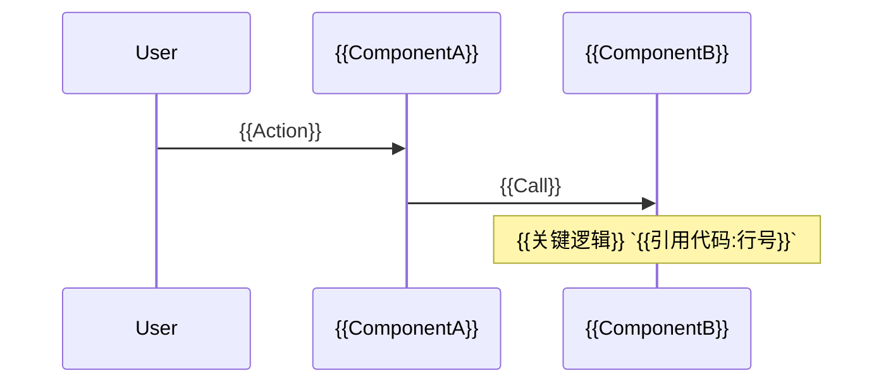

# 系统地图 (System Map)

## 执行摘要 (Executive Summary)

{{简要描述项目的核心功能、技术栈概览和当前状态}}

## 1. 架构概览 (Architecture Overview)

### 目录结构 (Directory Structure)

```text
{{关键目录树}}
```

### 架构图 (System Architecture)

```mermaid
graph TD
    {{系统组件图}}
```

**说明**:

- **{{组件A}}**: {{职责描述}} `{{相关代码路径}}`
- **{{组件B}}**: {{职责描述}} `{{相关代码路径}}`

## 2. 核心业务流 (Core Business Workflows)

### {{流程名称 1}} ({{Workflow Name 1}})

**描述**: {{业务逻辑描述}}



**关键代码引用**:

- [ ] **{{逻辑步骤}}**: `{{文件路径:行号}}`
- [ ] **{{逻辑步骤}}**: `{{文件路径:行号}}`

### {{流程名称 2}} ({{Workflow Name 2}})

...

## 3. 关键技术细节 (Key Technical Details)

### 数据模型 (Data Models)

```mermaid
classDiagram
    class {{ClassA}} {
        +{{Field}} : {{Type}}
    }
    class {{ClassB}} {
        ...
    }
    {{ClassA}} --> {{ClassB}}
```

### 核心算法/策略 (Core Logic)

- **{{策略名}}**:
  - 实现位置: `{{文件路径}}`
  - 逻辑说明: {{说明}}

## 4. 待办/风险观测 (Observations)

- [ ] ❓ {{发现的疑问或不一致}}
- [ ] ⚠️ {{潜在的技术债务或风险}}
